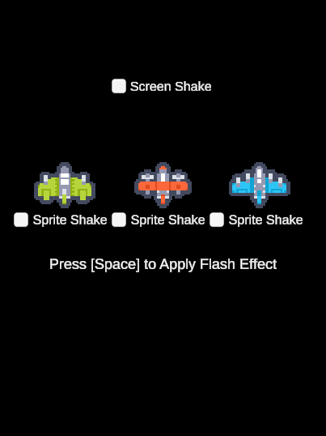

# Unity 2D Sprite Flash

This project demonstrates how to create a flash effect for 2D sprites using GUI/Text Shader material

## Screenshots

## Version History
**V 1.1 - (2025-03-29)**
- Shake options and effects added

**V 0.1 - (2025-03-28)**
- Initial version

# unity-sprite-flash
 unity 2d sprite flash effect
